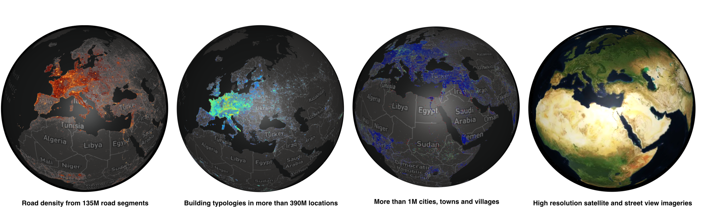
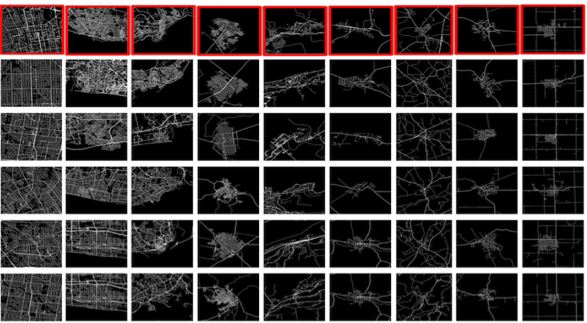
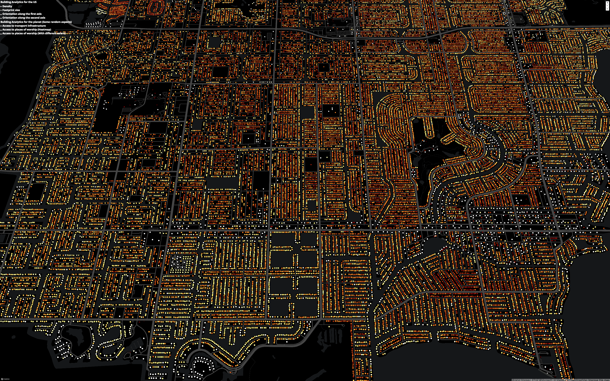

# Urban Analytics at the Scale of Planet
[Vahid Moosavi](https://vahidmoosavi.com/)
### 12 November 2018

# TL;DR 
* See the final results here: [here](https://sevamoo.github.io/urban-modeling-at-scale/urbanmodeling.html)  
* Read the instructions on how to make the whole pipeline here: https://sevamoo.github.io/urban-modeling-at-scale/
* Jupyter notebooks are [here](https://github.com/sevamoo/urban-modeling-at-scale/blob/master/OSM_Buildings_Planet_POI_search_20181112.ipynb)

## Background
Recently, I have been working on a new project on urban modeling at the scale of planet. In this project I have been using mainly open source data sources such as OpenStreetMap. As an initial part of this project I am focused on the issue of  urban density and diversity, where I am interested to analyze following attributes related to patterns of urban development:

1- Global Road Network: The density and distribution of  road types/ length/ speed limits, in addition to graph centrality measures in the global road network from OSM with more than 135 Million road segments.

2- Building Morphology: Calculating the density, area and complexity of building footprints in more than 300M buildings available from OSM.

3- Spatial Distribution of more than 30 Million Points of Interests (POIs) in around 160 categories of business activities. In this part (on going yet) I am defining new measures showing diversity and density of urban centers.

Live demo: https://sevamoo.github.io/3d/

# Twin Cities in Informational Space: Whatever Your Question Might Be!
The ultimate goal of this project is to develop a multi-dimensional spatial engine, where we can associate many different aspects of urbanized world such as urban climate, economy and distribution of resources across the planet in a manner that Internet works and finally we can ask **comparative questions** regarding the local challenges, while being able to find answers or lessons learned from any other location all over the planet.

In another world, we might be able to find twin cities or twin neighborhoods or twin buildings in an informational space, depending on our questions, which are focused on certain aspects of cities.

Previously in a similar way I developed a visual query where we could find similar cities with similar road networks to the chosen area among more than 1 Million locations.

[Reference: Urban morphology meets deep learning: Exploring urban forms in one million cities, town and villages across the planet](https://arxiv.org/abs/1709.02939)
[project website](https://sevamoo.github.io/cityastext/)

#### Accesiblity to transport infrastructure

#### Accesiblity to different types of places of worship (e.g. churches, mosques, etc.)

#### Building footprint area (sqm)

#### Orientation of the building along the first main axis (between 0-180)
